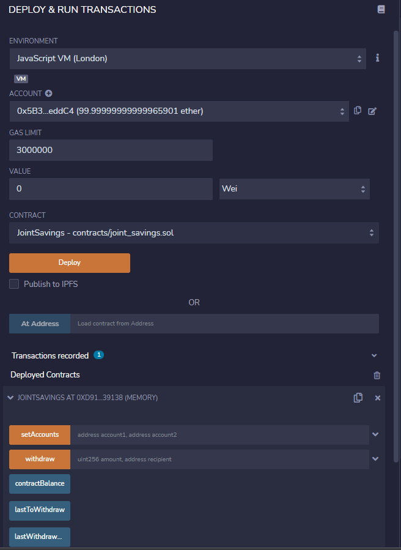

# Joint Savings Account - Solidity Project

## Deposit functionality Test
# 

## Compiling the Contract
#

#

## Deploying the Contract
#

* ETHER CONVERSION TO WEI
# 

* Transaction 1: Send 1 ether as wei.
#

 * Transaction 2: Send 5 ether as wei.
 #

* Transaction 3: Send 10 ether.
#

  
 ## Contract’s withdrawal functionality Testing 
 #
 * 5 ETH From Account 1 
 # 
 * 10 ETH From Account 2
 # 
  

 ##   Address and amount of last WIthdrawal Verification
 #
 

    
